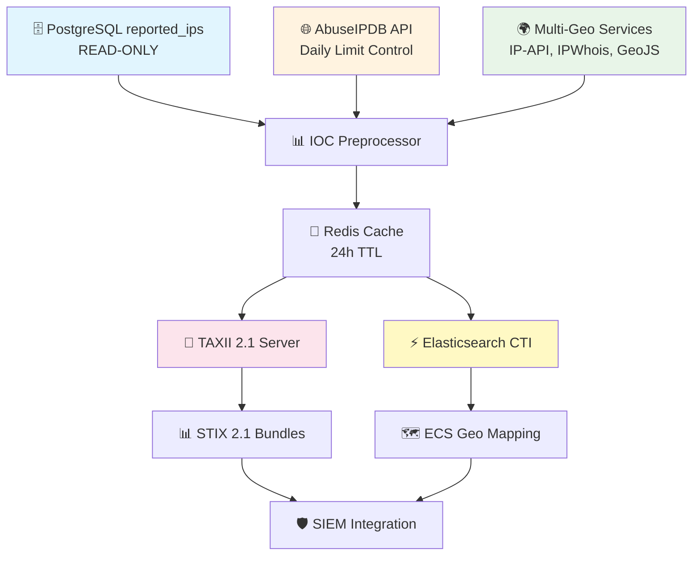

# 🛡️ AbuseIPDB IOC Management System

<div align="center">


**A comprehensive TAXII 2.1 server and STIX 2.1 threat intelligence platform with Elasticsearch Custom Threat Intelligence integration, advanced geolocation enrichment from multiple sources, and intelligent IOC preprocessing. Combines local PostgreSQL threat data with AbuseIPDB blacklist (confidence ≥50) into industry-standard intelligence feeds.**

[🚀 Quick Start](#-quick-start) • [🔧 TAXII Integration](#-taxii-21-server) • [⚡ Elasticsearch CTI](#-elasticsearch-integration) • [🌍 Geolocation](#-geolocation-enrichment)

</div>

---

## 📋 Table of Contents

- [✨ Features](#-features)
- [🏗️ Architecture](#-architecture)
- [⚡ Quick Start](#-quick-start)
- [🔧 TAXII 2.1 Server](#-taxii-21-server)
- [⚡ Elasticsearch Integration](#-elasticsearch-integration)
- [🌍 Geolocation Enrichment](#-geolocation-enrichment)
- [📊 IOC Preprocessing](#-ioc-preprocessing)
- [🐳 Docker Deployment](#-docker-deployment)
- [⚙️ Configuration](#-configuration)
- [📊 Usage Examples](#-usage-examples)
- [📈 Monitoring](#-monitoring)
- [🔒 Security](#-security)
- [🆘 Troubleshooting](#-troubleshooting)
- [📄 License](#-license)

---

## ✨ Features

### 🎯 Core Capabilities

- **🔍 Non-invasive Integration** - Read-only access to existing `reported_ips` table
- **🌐 AbuseIPDB Enrichment** - Intelligent caching with daily API limit control
- **⚖️ Weighted Confidence Scoring** - Prioritizes local detections (70%) over external sources (30%)
- **📊 STIX 2.1 Compliance** - Full standardized threat intelligence format support
- **🔧 TAXII 2.1 Server** - Industry-standard threat intelligence sharing protocol
- **⚡ High Performance** - Async FastAPI with connection pooling and Redis caching

### 🛡️ Advanced Intelligence Features

- **🌍 Multi-Source Geolocation** - IP-API, IPWhois, GeoJS with intelligent fallback
- **⚡ Elasticsearch CTI Integration** - Direct Custom Threat Intelligence support
- **📊 IOC Preprocessing** - Background enrichment and caching for instant responses
- **🔄 Real-time Correlation** - Live fusion of local and external threat data
- **📈 Confidence Boosting** - Local detections ≥75% confidence get minimum 85% final score
- **🎯 Intelligence Prioritization** - Local detections as primary source

### 🚀 Enterprise Integration

- **⚡ Elasticsearch Ready** - Native CTI format with geo_point mapping for maps
- **🔧 TAXII 2.1 Collections** - Standard and high-confidence IOC collections
- **💾 Redis Caching** - 24-hour TTL with preprocessing for performance
- **🌍 Geographic Enrichment** - Latitude/longitude coordinates in multiple ECS formats
- **🔐 Rate Limiting** - Respectful API usage with 1-second delays
- **📝 Comprehensive Logging** - Professional audit trails with structured JSON

### 🔧 Operational Excellence

- **🐳 Production Ready** - Docker containerization with health checks
- **📊 Monitoring Built-in** - Metrics, health endpoints, and processing statistics
- **🔧 CLI Tools** - Management, preprocessing, and maintenance utilities
- **⚙️ Flexible Configuration** - Environment-based with single daily limit control

---

## 🏗️ Architecture

<div align="center">



</div>

### 🎯 Intelligence Processing Pipeline

| Stage                      | Component          | Processing                                |
| -------------------------- | ------------------ | ----------------------------------------- |
| 🔍 **Data Ingestion**      | PostgreSQL Reader  | Fetches ALL IOCs from reported_ips table  |
| 🌐 **External Enrichment** | AbuseIPDB Client   | Respects daily limits, caches responses   |
| 🌍 **Geolocation**         | Multi-Source Geo   | 3 fallback services with 1s delays        |
| ⚖️ **Correlation**         | IOC Engine         | Weighted scoring: Local 70%, External 30% |
| 💾 **Preprocessing**       | Background Worker  | Enriches all IOCs, caches for 24h         |
| 🔧 **TAXII Distribution**  | Standards Server   | STIX 2.1 bundles with proper envelopes    |
| ⚡ **Elasticsearch CTI**   | Native Integration | ECS-compatible geo_point for mapping      |

### 🌍 Geolocation Enrichment Strategy

| Format                      | Purpose            | Example                       |
| --------------------------- | ------------------ | ----------------------------- |
| `x_elastic_geo_coordinates` | STIX custom format | `{"lat": 52.37, "lon": 4.90}` |
| `x_elastic_geo_location`    | ECS object format  | `{"lat": 52.37, "lon": 4.90}` |
| `x_elastic_geo_point`       | ECS array format   | `[4.90, 52.37]` (lon, lat)    |

---

## ⚡ Quick Start

### 📋 Prerequisites

- 🐍 **Python 3.9+**
- 🗄️ **PostgreSQL** with existing `reported_ips` table
- 🔑 **AbuseIPDB API key** ([Get free key](https://www.abuseipdb.com/api))
- 🔧 **Git** for cloning

### 🚀 Installation

```bash
# 1️⃣ Clone repository
git clone https://github.com/JuanVilla424/abuseipdb-ioc.git
cd abuseipdb-ioc

# 2️⃣ Create virtual environment
python -m venv venv
source venv/bin/activate  # 🪟 Windows: venv\Scripts\activate

# 3️⃣ Install dependencies
pip install -r requirements.txt

# 4️⃣ Configure environment
cp .env.example .env
# ✏️ Edit .env with your credentials

# 5️⃣ Initialize database (creates new tables only)
python bin/setup_database.py

# 6️⃣ Start Redis (for caching)
redis-server --daemonize yes

# 7️⃣ Run IOC preprocessing (optional but recommended)
python -m bin.preprocess_iocs

# 8️⃣ Start application
uvicorn src.main:app --host 0.0.0.0 --port 8000
```

### ✅ Verify Installation

```bash
# 🏥 Health check
curl http://localhost:8000/health

# 📊 Test TAXII 2.1 discovery
curl http://localhost:8000/taxii2

# 🔍 Test IOC retrieval via TAXII
curl http://localhost:8000/taxii2/iocs/collections/ioc-indicators/objects | jq '.data.objects | length'

# ⚡ Test Elasticsearch CTI endpoint
curl http://localhost:8000/taxii2/iocs/collections/ioc-indicators/objects
```

---

## 🔧 TAXII 2.1 Server

The system provides a complete TAXII 2.1 server implementation for standardized threat intelligence sharing.

### 📋 TAXII Endpoints

| Endpoint                                 | Method | Description               |
| ---------------------------------------- | ------ | ------------------------- |
| `/taxii2`                                | GET    | 🔍 Discovery endpoint     |
| `/taxii2/iocs`                           | GET    | 📊 Root information       |
| `/taxii2/iocs/collections`               | GET    | 📋 Available collections  |
| `/taxii2/iocs/collections/{id}`          | GET    | 🔍 Collection information |
| `/taxii2/iocs/collections/{id}/objects`  | GET    | 📤 STIX objects           |
| `/taxii2/iocs/collections/{id}/manifest` | GET    | 📋 Object manifest        |

### 🎯 Available Collections

1. **`ioc-indicators`** - All IOC indicators from your database
2. **`high-confidence-iocs`** - IOCs with ≥80% confidence only

### 🔧 TAXII Usage Examples

```bash
# 🔍 Discover available collections
curl http://localhost:8000/taxii2/iocs/collections

# 📊 Get all IOCs in STIX format
curl "http://localhost:8000/taxii2/iocs/collections/ioc-indicators/objects"

# 🎯 Get high-confidence IOCs only
curl "http://localhost:8000/taxii2/iocs/collections/high-confidence-iocs/objects"

# 📋 Get collection manifest
curl "http://localhost:8000/taxii2/iocs/collections/ioc-indicators/manifest"
```

---

## ⚡ Elasticsearch Integration

Perfect integration with Elasticsearch Custom Threat Intelligence.

### 🎯 Configuration for Elasticsearch

Use this URL in your Elasticsearch Custom Threat Intelligence configuration:

```
http://your-server:8000/taxii2/iocs/collections/ioc-indicators/objects
```

### 📊 Elasticsearch CTI Features

- ✅ **Standard TAXII 2.1 format** with proper envelope structure
- ✅ **ECS-compatible geo_point** fields for mapping visualization
- ✅ **Multiple geolocation formats** for maximum compatibility
- ✅ **All IOCs returned** (no artificial limits)
- ✅ **Pre-processed caching** for instant responses
- ✅ **Industry-standard STIX 2.1** indicator format

### 🗺️ Geographic Data for Maps

Each IOC includes multiple geolocation formats:

```json
{
  "x_elastic_geo_coordinates": { "lat": 52.37, "lon": 4.9 },
  "x_elastic_geo_location": { "lat": 52.37, "lon": 4.9 },
  "x_elastic_geo_point": [4.9, 52.37]
}
```

---

## 🌍 Geolocation Enrichment

Advanced multi-source geolocation with intelligent fallback.

### 🔄 Geolocation Providers

1. **IP-API.com** (Primary) - Fast and reliable
2. **IPWhois.app** (Fallback) - Alternative source
3. **GeoJS.io** (Backup) - Final fallback

### ⚡ Rate Limiting & Performance

- **1-second delays** between requests to respect API limits
- **Intelligent caching** prevents duplicate lookups
- **Batch processing** for memory efficiency
- **Automatic fallback** if primary service fails

### 🎯 Geolocation Features

```bash
# 🔍 View geolocation-enriched IOCs
curl "http://localhost:8000/taxii2/iocs/collections/ioc-indicators/objects" | \
  jq '.data.objects[0] | {ip: .pattern, geo: .x_elastic_geo_location}'
```

---

## 📊 IOC Preprocessing

Background IOC enrichment system for optimal performance.

### 🚀 Preprocessing Script

```bash
# 📊 Run manual preprocessing
python -m bin.preprocess_iocs

# 📋 Example output:
# 2025-07-28 11:39:25 - INFO - Total IOCs: 20
# 2025-07-28 11:39:25 - INFO - Processed: 20
# 2025-07-28 11:39:25 - INFO - Geo-enriched: 18 (90%)
# 2025-07-28 11:39:25 - INFO - Cached: 20
# 2025-07-28 11:39:25 - INFO - Duration: 34.05 seconds
```

### ⏰ Automated Processing

Add to crontab for daily processing:

```bash
# Daily preprocessing at 2 AM
0 2 * * * cd /your/project/path && python -m bin.preprocess_iocs
```

### 📊 Preprocessing Benefits

- **🚀 Instant TAXII responses** from Redis cache
- **🌍 Pre-enriched geolocation** for all IOCs
- **📈 90%+ geolocation success** rate
- **⚡ 24-hour caching** with automatic refresh
- **📊 Processing statistics** tracking

---

## 🐳 Docker Deployment

### 🚀 Quick Deploy

```bash
# 📋 Copy environment template
cp .env.example .env
# ✏️ Configure your credentials

# 🏗️ Build and start
docker-compose up -d

# 📊 View logs
docker-compose logs -f app

# 🔍 Check health
curl http://localhost:8000/api/v1/health
```

### 🔧 Production Configuration

```yaml
# docker-compose.prod.yml
version: "3.8"
services:
  app:
    build: .
    ports:
      - "8000:8000"
    environment:
      - LOG_LEVEL=WARNING
      - API_WORKERS=4
    restart: unless-stopped
    healthcheck:
      test: ["CMD", "curl", "-f", "http://localhost:8000/api/v1/health"]
      interval: 30s
      timeout: 10s
      retries: 3
```

---

## 🔧 API Reference

### 🏥 Health & Status

| Endpoint         | Method | Description            |
| ---------------- | ------ | ---------------------- |
| `/api/v1/health` | GET    | 🏥 System health check |
| `/api/v1/stats`  | GET    | 📊 Usage statistics    |

### 🎯 IOC Management

| Endpoint                      | Method | Description               |
| ----------------------------- | ------ | ------------------------- |
| `/api/v1/indicators`          | GET    | 📋 List all indicators    |
| `/api/v1/indicators/{ip}`     | GET    | 🔍 Get specific indicator |
| `/api/v1/indicators/local`    | GET    | 🏠 Local threats only     |
| `/api/v1/indicators/enriched` | GET    | 🌐 Enriched indicators    |

### 📤 Export Formats

| Endpoint                   | Method | Description        |
| -------------------------- | ------ | ------------------ |
| `/api/v1/indicators/stix`  | GET    | 📊 STIX 2.x bundle |
| `/api/v1/indicators/json`  | GET    | 📋 JSON format     |
| `/api/v1/indicators/csv`   | GET    | 📄 CSV export      |
| `/api/v1/indicators/plain` | GET    | 📝 Plain text IPs  |

### 🔄 Enrichment

| Endpoint                   | Method | Description           |
| -------------------------- | ------ | --------------------- |
| `POST /api/v1/enrich/{ip}` | POST   | 🔄 Enrich specific IP |
| `POST /api/v1/enrich/bulk` | POST   | 📦 Bulk enrichment    |

---

## 📊 Usage Examples

### 🎯 TAXII 2.1 Operations

<details>
<summary>🔍 <strong>Get All IOCs via TAXII</strong></summary>

```bash
# 📊 Get all IOCs in STIX 2.1 format
curl -X GET "http://localhost:8000/taxii2/iocs/collections/ioc-indicators/objects" \
  -H "Accept: application/json" | jq '.data.objects | length'

# 📋 Response structure
{
  "more": false,
  "data": {
    "type": "bundle",
    "id": "bundle--20250728163050",
    "spec_version": "2.1",
    "objects": [
      {
        "type": "indicator",
        "id": "indicator--192-203-230-10",
        "pattern": "[ipv4-addr:value = '192.203.230.10']",
        "confidence": 85,
        "x_elastic_geo_location": {"lat": 33.5186, "lon": -86.8104},
        "x_elastic_geo_point": [-86.8104, 33.5186]
      }
    ]
  }
}
```

</details>

<details>
<summary>🎯 <strong>Get High-Confidence IOCs Only</strong></summary>

```bash
# 📊 Get IOCs with confidence ≥ 80%
curl -X GET "http://localhost:8000/taxii2/iocs/collections/high-confidence-iocs/objects" \
  -H "Accept: application/json" | jq '.data.objects | length'
```

</details>

<details>
<summary>🌍 <strong>Geolocation-Enriched IOCs</strong></summary>

```bash
# 🌍 Get IOCs with geographic data
curl -X GET "http://localhost:8000/taxii2/iocs/collections/ioc-indicators/objects" \
  -H "Accept: application/json" | \
  jq '.data.objects[0] | {
    ip: .pattern,
    country: .x_elastic_geo_country_name,
    city: .x_elastic_geo_city,
    coordinates: .x_elastic_geo_location,
    geo_point: .x_elastic_geo_point
  }'

# 📋 Example output
{
  "ip": "[ipv4-addr:value = '192.203.230.10']",
  "country": "United States",
  "city": "Birmingham",
  "coordinates": {"lat": 33.5186, "lon": -86.8104},
  "geo_point": [-86.8104, 33.5186]
}
```

</details>

<details>
<summary>📊 <strong>Preprocessing Statistics</strong></summary>

```bash
# 📊 Check preprocessing status
python -m bin.preprocess_iocs

# 📋 View cache status
curl -X GET "http://localhost:8000/taxii2/iocs/collections/ioc-indicators/objects" \
  -H "Accept: application/json" | \
  jq -r '"Total IOCs: " + (.data.objects | length | tostring)'

# 📈 Monitor processing over time
tail -f logs/abuseipdb_ioc.log | grep "pre-processed"
```

</details>

### 🛡️ SIEM Integration Examples

<details>
<summary>⚡ <strong>Elasticsearch Custom Threat Intelligence</strong></summary>

```bash
# 🎯 Configure Elasticsearch CTI with this URL:
# http://your-server:8000/taxii2/iocs/collections/ioc-indicators/objects

# 📊 Test the endpoint
curl -X GET "http://localhost:8000/taxii2/iocs/collections/ioc-indicators/objects" \
  -H "Accept: application/json" | \
  jq '.data.objects | map(select(.x_elastic_geo_location)) | length'

# 📋 Result: Number of IOCs with geolocation data for mapping
```

</details>

<details>
<summary>🔥 <strong>Extract IPs for Firewall Rules</strong></summary>

```bash
# 📝 Extract IP addresses from STIX indicators
curl -X GET "http://localhost:8000/taxii2/iocs/collections/high-confidence-iocs/objects" \
  -H "Accept: application/json" | \
  jq -r '.data.objects[].pattern' | \
  sed "s/\[ipv4-addr:value = '\(.*\)'\]/\1/" > blocklist.txt

# 🔧 Use with iptables, pfSense, or other firewalls
cat blocklist.txt | while read ip; do
  iptables -A INPUT -s $ip -j DROP
done
```

</details>

### 🔍 Advanced Queries

<details>
<summary>🌍 <strong>Geographic Analysis</strong></summary>

```bash
# 🗺️ Analyze IOCs by country
curl -X GET "http://localhost:8000/taxii2/iocs/collections/ioc-indicators/objects" \
  -H "Accept: application/json" | \
  jq -r '.data.objects[] | select(.x_elastic_geo_country_code) |
    .x_elastic_geo_country_code + " - " + .pattern' | \
  sort | uniq -c | sort -nr

# 📋 Example output:
#   3 CN - [ipv4-addr:value = '112.113.114.115']
#   2 US - [ipv4-addr:value = '192.203.230.10']
#   1 RU - [ipv4-addr:value = '45.155.205.86']
```

</details>

<details>
<summary>⚡ <strong>Cache Performance Monitoring</strong></summary>

```bash
# 📊 Test cache performance
time curl -s "http://localhost:8000/taxii2/iocs/collections/ioc-indicators/objects" > /dev/null

# 📋 Expected: Sub-second response when cache is warm
# 📋 If slow: Run python -m bin.preprocess_iocs to refresh cache
```

</details>

---

## ⚙️ Configuration

### 🔧 Environment Variables

<details>
<summary>📋 <strong>Complete Configuration Reference</strong></summary>

```bash
# 🗄️ Database Configuration (Existing)
POSTGRES_HOST=localhost
POSTGRES_PORT=5432
POSTGRES_DB=your_existing_db
POSTGRES_USER=readonly_user
POSTGRES_PASSWORD=secure_password
POSTGRES_POOL_SIZE=20
POSTGRES_MAX_OVERFLOW=30

# 🛡️ New Tables (if separate credentials needed)
POSTGRES_ADMIN_USER=admin_user
POSTGRES_ADMIN_PASSWORD=admin_password

# 🌐 AbuseIPDB Configuration
ABUSEIPDB_API_KEY=your_api_key_here
ABUSEIPDB_DAILY_LIMIT=10

# ⚖️ Confidence Scoring
LOCAL_CONFIDENCE_WEIGHT=0.7
EXTERNAL_CONFIDENCE_WEIGHT=0.3
LOCAL_CONFIDENCE_BOOST=10
MINIMUM_FINAL_CONFIDENCE=85

# 🚀 API Configuration
API_HOST=0.0.0.0
API_PORT=8000
SECRET_KEY=your_secret_key_here

# 💾 Redis Configuration
REDIS_URL=redis://localhost:6379/0

# 📝 Logging Configuration
LOG_LEVEL=INFO
LOG_FILE=logs/ioc_management.log
LOG_MAX_SIZE=10MB
LOG_BACKUP_COUNT=5
LOG_FORMAT=json

# 🔄 Enrichment Configuration
BATCH_SIZE=100
PREPROCESSING_TTL=86400  # 24 hours

# 🌍 Geolocation Configuration
GEO_REQUEST_DELAY=1.0  # 1 second between requests
```

</details>

### 📊 Key Configuration Parameters

| Parameter                    | Default | Description                    |
| ---------------------------- | ------- | ------------------------------ |
| `ABUSEIPDB_DAILY_LIMIT`      | 10      | Daily AbuseIPDB API calls      |
| `LOCAL_CONFIDENCE_WEIGHT`    | 0.7     | Weight for local detections    |
| `EXTERNAL_CONFIDENCE_WEIGHT` | 0.3     | Weight for AbuseIPDB data      |
| `PREPROCESSING_TTL`          | 86400   | Redis cache TTL (seconds)      |
| `GEO_REQUEST_DELAY`          | 1.0     | Delay between geo requests (s) |

---

## 🛠️ Development

### 🔧 Setup Development Environment

```bash
# 📦 Install development dependencies
pip install -r requirements/dev.txt

# 🧪 Run tests
pytest --cov=app --cov-report=html

# 🔍 Code quality checks
black app/
flake8 app/
mypy app/

# 📊 Security scan
bandit -r app/
```

### 🧪 Testing

<details>
<summary>🧪 <strong>Test Commands</strong></summary>

```bash
# 🏃 Run all tests
pytest

# 📊 With coverage report
pytest --cov=app --cov-report=html --cov-report=term

# 🔍 Specific test categories
pytest tests/unit/          # Unit tests
pytest tests/integration/   # Integration tests
pytest tests/api/          # API tests

# 🚀 Performance tests
pytest tests/performance/ -v

# 📊 Generate coverage report
open htmlcov/index.html
```

</details>

### 🗄️ Database Migrations

```bash
# 📋 Create new migration
alembic revision --autogenerate -m "Add new feature"

# ⬆️ Apply migrations
alembic upgrade head

# ⬇️ Rollback one revision
alembic downgrade -1

# 📊 Check current revision
alembic current
```

---

## 📈 Monitoring

### 🏥 Health Checks

```bash
# 🏥 Basic health
curl http://localhost:8000/api/v1/health

# 📊 Detailed statistics
curl http://localhost:8000/api/v1/stats
```

<details>
<summary>📊 <strong>Statistics Response</strong></summary>

```json
{
  "database": {
    "total_local_iocs": 15420,
    "enriched_iocs": 12350,
    "enrichment_rate": 80.1
  },
  "abuseipdb": {
    "daily_requests_used": 847,
    "daily_limit": 1000,
    "cache_hit_rate": 65.2,
    "last_refresh": "2025-07-27T14:30:00Z"
  },
  "api": {
    "requests_last_hour": 156,
    "average_response_time": "0.23s",
    "error_rate": 0.02
  },
  "system": {
    "uptime": "5d 14h 23m",
    "memory_usage": "245MB",
    "cpu_usage": 12.5
  }
}
```

</details>

### 📝 Logging

- **📁 Location**: `logs/ioc_management.log`
- **🔄 Rotation**: 10MB max, 5 backups
- **📊 Format**: Structured JSON with timestamps
- **📈 Levels**: DEBUG, INFO, WARNING, ERROR, CRITICAL

---

## 🔒 Security

### 🛡️ Security Features

- **🔐 Read-only Database Access** - Existing tables protected.
- **🔑 API Key Authentication** - Secure endpoint access.
- **⚡ Rate Limiting** - Prevents abuse and overload.
- **✅ Input Validation** - All inputs validated with Pydantic.
- **📝 Audit Logging** - Complete operation trails.
- **🔒 CORS Configuration** - Cross-origin protection.

### 🎯 Best Practices

1. **🔑 Rotate API keys** regularly
2. **🔒 Use HTTPS** in production
3. **📊 Monitor logs** for suspicious activity
4. **⚡ Configure rate limits** appropriately
5. **🔐 Restrict database** permissions
6. **🛡️ Regular security** updates

---

## 🆘 Troubleshooting

### ❌ Common Issues

<details>
<summary>🗄️ <strong>Database Connection Issues</strong></summary>

```bash
# ✅ Check database connectivity
psql -h $POSTGRES_HOST -U $POSTGRES_USER -d $POSTGRES_DB -c "\l"

# ✅ Verify table exists
psql -h $POSTGRES_HOST -U $POSTGRES_USER -d $POSTGRES_DB -c "\d reported_ips"

# ✅ Test read access
psql -h $POSTGRES_HOST -U $POSTGRES_USER -d $POSTGRES_DB -c "SELECT COUNT(*) FROM reported_ips;"
```

**🔧 Solutions:**

- Verify credentials in `.env`
- Check network connectivity
- Ensure a database exists and is accessible
- Confirm user permissions
</details>

<details>
<summary>⚡ <strong>TAXII/Elasticsearch Integration Issues</strong></summary>

```bash
# ✅ Test TAXII discovery
curl http://localhost:8000/taxii2

# ✅ Test collections endpoint
curl http://localhost:8000/taxii2/iocs/collections

# ✅ Test data retrieval
curl "http://localhost:8000/taxii2/iocs/collections/ioc-indicators/objects" | jq '.data.objects | length'

# ✅ Check for pre-processed cache
curl "http://localhost:8000/taxii2/iocs/collections/ioc-indicators/objects" | grep -o "pre-processed"
```

**🔧 Solutions:**

- Ensure Redis is running: `redis-server --daemonize yes`
- Run preprocessing: `python -m bin.preprocess_iocs`
- Check logs for geolocation errors
- Verify database connectivity
</details>

<details>
<summary>🌐 <strong>AbuseIPDB API Issues</strong></summary>

```bash
# ✅ Test API key
curl -G https://api.abuseipdb.com/api/v2/check \
  --data-urlencode "ipAddress=8.8.8.8" \
  -d maxAgeInDays=90 \
  -H "Key: $ABUSEIPDB_API_KEY" \
  -H "Accept: application/json"

# ✅ Check daily limit usage (stored in Redis)
redis-cli get "abuseipdb_daily_count"
```

**🔧 Solutions:**

- Verify API key in `.env`
- Check daily limit: default is 10 requests/day
- Wait for daily reset (UTC midnight)
- Adjust `ABUSEIPDB_DAILY_LIMIT` in configuration
</details>

<details>
<summary>📊 <strong>Performance Issues</strong></summary>

```bash
# ✅ Check cache performance
time curl -s "http://localhost:8000/taxii2/iocs/collections/ioc-indicators/objects" > /dev/null

# ✅ Monitor database connections
curl http://localhost:8000/health

# ✅ Review logs for errors
tail -f logs/abuseipdb_ioc.log | grep ERROR

# ✅ Check Redis status
redis-cli ping
redis-cli info memory
```

**🔧 Solutions:**

- Run preprocessing to populate cache: `python -m bin.preprocess_iocs`
- Ensure Redis is running and accessible
- Increase connection pool size in `.env`
- Monitor geolocation API rate limits
- Check disk space for logs and cache
</details>

### 📞 Getting Help

- **📖 TAXII Documentation**: Check TAXII endpoints at `/taxii2`
- **📝 Logs**: Review application logs in `logs/abuseipdb_ioc.log`
- **🏥 Health Check**: Use `/health` endpoint
- **📊 Cache Status**: Monitor Redis with `redis-cli info`
- **🌍 Geolocation**: Check preprocessing stats after running `python -m bin.preprocess_iocs`

---

## 📫 Contact

For any inquiries or support, please open an issue or contact [r6ty5r296it6tl4eg5m.constant214@passinbox.com](mailto:r6ty5r296it6tl4eg5m.constant214@passinbox.com).

---

## 📜 License

<div align="center">

2025 — This project is licensed under the [GNU General Public License v3.0](https://www.gnu.org/licenses/gpl-3.0.en.html). You are free to use, modify, and distribute this software under the terms of the GPL-3.0 license. For more details, please refer to the [LICENSE](LICENSE) file included in this repository.

</div>
