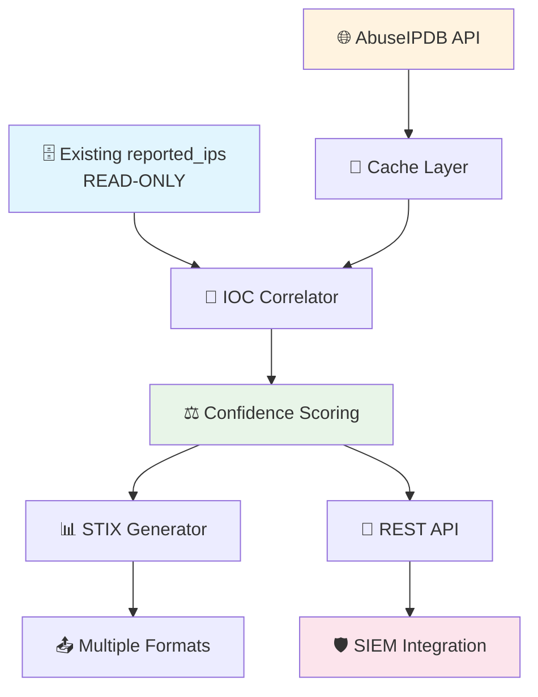

# 🛡️ IOC Management System

<div align="center">


**A comprehensive threat intelligence platform that leverages existing PostgreSQL threat data and enriches it with AbuseIPDB intelligence, exposing standardized IOCs via REST API for SIEM integration.**

[🚀 Quick Start](#-quick-start) • [🔧 API Reference](#-api-reference) • [🐳 Docker](#-docker-deployment) • [🛠️ Development](#-development)

</div>

---

## 📋 Table of Contents

- [✨ Features](#-features)
- [⚡ Quick Start](#-quick-start)
- [🐳 Docker Deployment](#-docker-deployment)
- [🔧 API Reference](#-api-reference)
- [📊 Usage Examples](#-usage-examples)
- [📈 Monitoring](#-monitoring)
- [🔒 Security](#-security)
- [🆘 Troubleshooting](#-troubleshooting)
- [📄 License](#-license)

---

## ✨ Features

### 🎯 Core Capabilities

- **🔍 Non-invasive Integration** - Read-only access to existing `reported_ips` table
- **🌐 AbuseIPDB Enrichment—**Intelligent caching with rate limiting (1,000+ requests/day)
- **⚖️ Weighted Confidence Scoring** - Prioritizes local detections (70%) over external sources (30%)
- **📊 STIX 2.x Compliance—**Full standardized threat intelligence format support
- **🔄 Multiple Export Formats** - JSON, STIX bundles, CSV, plain text
- **⚡ High Performance** - Async FastAPI with connection pooling

### 🛡️ Security & Intelligence

- **🎯 Intelligence Prioritization—**Local detections as primary source
- **🔄 Real-time Correlation—**Live fusion of local and external threat data
- **📈 Confidence Boosting** - Local detections ≥75% confidence get minimum 85% final score
- **🔐 Secure API** - Key-based authentication with rate limiting
- **📝 Comprehensive Logging—**Professional audit trails with file rotation

### 🚀 Integration Ready

- **🔌 SIEM Compatible** - Direct integration with Elastic, Splunk, QRadar
- **🐳 Production Ready** - Docker containerization with health checks
- **📊 Monitoring Built-in** - Metrics, health endpoints, and alerting
- **🔧 CLI Tools** - Management and maintenance utilities

---

## 🏗️ Architecture

<div align="center">



</div>

### 🎯 Intelligence Prioritization Strategy

| Source                  | Weight   | Confidence Boost | Use Case                    |
| ----------------------- | -------- | ---------------- | --------------------------- |
| 🏠 **Local Detections** | 70%      | +10% (min 85%)   | Primary threat intelligence |
| 🌐 **AbuseIPDB**        | 30%      | Validation only  | External enrichment         |
| 🔄 **Combined**         | Weighted | Smart fusion     | Enhanced IOC quality        |

---

## ⚡ Quick Start

### 📋 Prerequisites

- 🐍 **Python 3.9+**
- 🗄️ **PostgreSQL** with existing `reported_ips` table
- 🔑 **AbuseIPDB API key** ([Get free key](https://www.abuseipdb.com/api))
- 🔧 **Git** for cloning

### 🚀 Installation

```bash
# 1️⃣ Clone repository
git clone https://github.com/JuanVilla424/abuseipdb-ioc.git
cd abuseipdb-ioc

# 2️⃣ Create virtual environment
python -m venv venv
source venv/bin/activate  # 🪟 Windows: venv\Scripts\activate

# 3️⃣ Install dependencies
pip install -r requirements.txt

# 4️⃣ Configure environment
cp .env.example .env
# ✏️ Edit .env with your credentials

# 5️⃣ Initialize database (creates new tables only)
python bin/setup_database.py

# 6️⃣ Start application
uvicorn app.main:app --host 0.0.0.0 --port 8000
```

### ✅ Verify Installation

```bash
# 🏥 Health check
curl http://localhost:8000/api/v1/health

# 📊 View statistics
curl http://localhost:8000/api/v1/stats

# 🔍 Test IOC retrieval
curl http://localhost:8000/api/v1/indicators?limit=5
```

---

## 🐳 Docker Deployment

### 🚀 Quick Deploy

```bash
# 📋 Copy environment template
cp .env.example .env
# ✏️ Configure your credentials

# 🏗️ Build and start
docker-compose up -d

# 📊 View logs
docker-compose logs -f app

# 🔍 Check health
curl http://localhost:8000/api/v1/health
```

### 🔧 Production Configuration

```yaml
# docker-compose.prod.yml
version: "3.8"
services:
  app:
    build: .
    ports:
      - "8000:8000"
    environment:
      - LOG_LEVEL=WARNING
      - API_WORKERS=4
    restart: unless-stopped
    healthcheck:
      test: ["CMD", "curl", "-f", "http://localhost:8000/api/v1/health"]
      interval: 30s
      timeout: 10s
      retries: 3
```

---

## 🔧 API Reference

### 🏥 Health & Status

| Endpoint         | Method | Description            |
| ---------------- | ------ | ---------------------- |
| `/api/v1/health` | GET    | 🏥 System health check |
| `/api/v1/stats`  | GET    | 📊 Usage statistics    |

### 🎯 IOC Management

| Endpoint                      | Method | Description               |
| ----------------------------- | ------ | ------------------------- |
| `/api/v1/indicators`          | GET    | 📋 List all indicators    |
| `/api/v1/indicators/{ip}`     | GET    | 🔍 Get specific indicator |
| `/api/v1/indicators/local`    | GET    | 🏠 Local threats only     |
| `/api/v1/indicators/enriched` | GET    | 🌐 Enriched indicators    |

### 📤 Export Formats

| Endpoint                   | Method | Description        |
| -------------------------- | ------ | ------------------ |
| `/api/v1/indicators/stix`  | GET    | 📊 STIX 2.x bundle |
| `/api/v1/indicators/json`  | GET    | 📋 JSON format     |
| `/api/v1/indicators/csv`   | GET    | 📄 CSV export      |
| `/api/v1/indicators/plain` | GET    | 📝 Plain text IPs  |

### 🔄 Enrichment

| Endpoint                   | Method | Description           |
| -------------------------- | ------ | --------------------- |
| `POST /api/v1/enrich/{ip}` | POST   | 🔄 Enrich specific IP |
| `POST /api/v1/enrich/bulk` | POST   | 📦 Bulk enrichment    |

---

## 📊 Usage Examples

### 🎯 Basic Operations

<details>
<summary>🔍 <strong>Get High-Confidence IOCs</strong></summary>

```bash
# 📊 Get IOCs with confidence ≥ 90%
curl -X GET "http://localhost:8000/api/v1/indicators?min_confidence=90&limit=100" \
  -H "Accept: application/json" | jq '.'

# 📋 Response format
{
  "indicators": [
    {
      "ip_address": "192.168.1.100",
      "confidence": 95,
      "local_confidence": 85,
      "abuseipdb_confidence": 100,
      "reported_at": "2025-07-27T10:30:00Z",
      "categories": ["malware", "botnet"],
      "country_code": "CN",
      "enriched": true
    }
  ],
  "total": 150,
  "page": 1
}
```

</details>

<details>
<summary>📊 <strong>Export as STIX Bundle</strong></summary>

```bash
# 📊 Export high-confidence IOCs as STIX 2.x
curl -X GET "http://localhost:8000/api/v1/indicators/stix?min_confidence=85" \
  -H "Accept: application/json" \
  -o threat_intel.json

# 📋 STIX Bundle format
{
  "type": "bundle",
  "id": "bundle--f47ac10b-58cc-4372-a567-0e02b2c3d479",
  "objects": [
    {
      "type": "indicator",
      "id": "indicator--f47ac10b-58cc-4372-a567-0e02b2c3d480",
      "created": "2025-07-27T10:30:00.000Z",
      "pattern": "[ipv4-addr:value = '192.168.1.100']",
      "labels": ["malicious-activity"],
      "confidence": 95,
      "custom_properties": {
        "x_local_detection": true,
        "x_local_confidence": 85,
        "x_abuseipdb_confidence": 100
      }
    }
  ]
}
```

</details>

<details>
<summary>🔄 <strong>Bulk Enrichment</strong></summary>

```bash
# 📦 Enrich multiple IPs
curl -X POST "http://localhost:8000/api/v1/enrich/bulk" \
  -H "Content-Type: application/json" \
  -d '{
    "ip_addresses": ["192.168.1.1", "10.0.0.1", "172.16.0.1"],
    "force_refresh": false
  }'

# 📋 Response
{
  "enriched": 3,
  "failed": 0,
  "cached": 1,
  "fresh": 2,
  "processing_time": "2.3s"
}
```

</details>

### 🛡️ SIEM Integration Examples

<details>
<summary>⚡ <strong>Elastic SIEM Integration</strong></summary>

```bash
# 📊 CSV format for Elastic ingest
curl -X GET "http://localhost:8000/api/v1/indicators/csv?fresh_only=true&min_confidence=80" \
  -o elastic_threats.csv

# 📋 Headers: ip_address,confidence,categories,country_code,reported_at
# Use with Elastic Logstash or Beats for automated ingestion
```

</details>

<details>
<summary>🔥 <strong>Firewall Blocklist</strong></summary>

```bash
# 📝 Plain text for firewall rules
curl -X GET "http://localhost:8000/api/v1/indicators/plain?min_confidence=90" \
  -o blocklist.txt

# 🔧 Use with iptables, pfSense, or other firewalls
cat blocklist.txt | while read ip; do
  iptables -A INPUT -s $ip -j DROP
done
```

</details>

### 🔍 Advanced Queries

<details>
<summary>🕐 <strong>Recent Threats Only</strong></summary>

```bash
# 📅 Last 24 hours with high confidence
curl -X GET "http://localhost:8000/api/v1/indicators?fresh_only=true&min_confidence=85&hours=24" \
  -H "Accept: application/json"
```

</details>

<details>
<summary>🌍 <strong>Geographic Filtering</strong></summary>

```bash
# 🗺️ Filter by country (requires enrichment)
curl -X GET "http://localhost:8000/api/v1/indicators/enriched?country=CN,RU&min_confidence=75" \
  -H "Accept: application/json"
```

</details>

---

## ⚙️ Configuration

### 🔧 Environment Variables

<details>
<summary>📋 <strong>Complete Configuration Reference</strong></summary>

```bash
# 🗄️ Database Configuration (Existing)
POSTGRES_HOST=localhost
POSTGRES_PORT=5432
POSTGRES_DB=your_existing_db
POSTGRES_USER=readonly_user
POSTGRES_PASSWORD=secure_password
POSTGRES_POOL_SIZE=20
POSTGRES_MAX_OVERFLOW=30

# 🛡️ New Tables (if separate credentials needed)
POSTGRES_ADMIN_USER=admin_user
POSTGRES_ADMIN_PASSWORD=admin_password

# 🌐 AbuseIPDB Configuration
ABUSEIPDB_API_KEY=your_api_key_here
ABUSEIPDB_CONFIDENCE_MINIMUM=75
ABUSEIPDB_RATE_LIMIT=1000
ABUSEIPDB_CACHE_HOURS=24

# ⚖️ Confidence Scoring
LOCAL_CONFIDENCE_WEIGHT=0.7
EXTERNAL_CONFIDENCE_WEIGHT=0.3
LOCAL_CONFIDENCE_BOOST=10
MINIMUM_FINAL_CONFIDENCE=85

# 🚀 API Configuration
API_HOST=0.0.0.0
API_PORT=8000
API_SECRET_KEY=your_secret_key_here
API_RATE_LIMIT=100
API_WORKERS=4

# 📝 Logging Configuration
LOG_LEVEL=INFO
LOG_FILE=logs/ioc_management.log
LOG_MAX_SIZE=10MB
LOG_BACKUP_COUNT=5
LOG_FORMAT=json

# 🔄 Enrichment Configuration
ENRICHMENT_INTERVAL_HOURS=12
CACHE_REFRESH_HOURS=24
BATCH_SIZE=100
MAX_CONCURRENT_ENRICHMENTS=10
```

</details>

### 📊 Confidence Scoring Configuration

| Parameter                    | Default | Description                     |
| ---------------------------- | ------- | ------------------------------- |
| `LOCAL_CONFIDENCE_WEIGHT`    | 0.7     | Weight for local detections     |
| `EXTERNAL_CONFIDENCE_WEIGHT` | 0.3     | Weight for AbuseIPDB data       |
| `LOCAL_CONFIDENCE_BOOST`     | 10      | Boost for high-confidence local |
| `MINIMUM_FINAL_CONFIDENCE`   | 85      | Minimum for boosted local IOCs  |

---

## 🛠️ Development

### 🔧 Setup Development Environment

```bash
# 📦 Install development dependencies
pip install -r requirements/dev.txt

# 🧪 Run tests
pytest --cov=app --cov-report=html

# 🔍 Code quality checks
black app/
flake8 app/
mypy app/

# 📊 Security scan
bandit -r app/
```

### 🧪 Testing

<details>
<summary>🧪 <strong>Test Commands</strong></summary>

```bash
# 🏃 Run all tests
pytest

# 📊 With coverage report
pytest --cov=app --cov-report=html --cov-report=term

# 🔍 Specific test categories
pytest tests/unit/          # Unit tests
pytest tests/integration/   # Integration tests
pytest tests/api/          # API tests

# 🚀 Performance tests
pytest tests/performance/ -v

# 📊 Generate coverage report
open htmlcov/index.html
```

</details>

### 🗄️ Database Migrations

```bash
# 📋 Create new migration
alembic revision --autogenerate -m "Add new feature"

# ⬆️ Apply migrations
alembic upgrade head

# ⬇️ Rollback one revision
alembic downgrade -1

# 📊 Check current revision
alembic current
```

---

## 📈 Monitoring

### 🏥 Health Checks

```bash
# 🏥 Basic health
curl http://localhost:8000/api/v1/health

# 📊 Detailed statistics
curl http://localhost:8000/api/v1/stats
```

<details>
<summary>📊 <strong>Statistics Response</strong></summary>

```json
{
  "database": {
    "total_local_iocs": 15420,
    "enriched_iocs": 12350,
    "enrichment_rate": 80.1
  },
  "abuseipdb": {
    "daily_requests_used": 847,
    "daily_limit": 1000,
    "cache_hit_rate": 65.2,
    "last_refresh": "2025-07-27T14:30:00Z"
  },
  "api": {
    "requests_last_hour": 156,
    "average_response_time": "0.23s",
    "error_rate": 0.02
  },
  "system": {
    "uptime": "5d 14h 23m",
    "memory_usage": "245MB",
    "cpu_usage": 12.5
  }
}
```

</details>

### 📝 Logging

- **📁 Location**: `logs/ioc_management.log`
- **🔄 Rotation**: 10MB max, 5 backups
- **📊 Format**: Structured JSON with timestamps
- **📈 Levels**: DEBUG, INFO, WARNING, ERROR, CRITICAL

---

## 🔒 Security

### 🛡️ Security Features

- **🔐 Read-only Database Access** - Existing tables protected
- **🔑 API Key Authentication—**Secure endpoint access
- **⚡ Rate Limiting—**Prevents abuse and overload
- **✅ Input Validation—**All inputs validated with Pydantic
- **📝 Audit Logging—**Complete operation trails
- **🔒 CORS Configuration** - Cross-origin protection

### 🎯 Best Practices

1. **🔑 Rotate API keys** regularly
2. **🔒 Use HTTPS** in production
3. **📊 Monitor logs** for suspicious activity
4. **⚡ Configure rate limits** appropriately
5. **🔐 Restrict database** permissions
6. **🛡️ Regular security** updates

---

## 🆘 Troubleshooting

### ❌ Common Issues

<details>
<summary>🗄️ <strong>Database Connection Issues</strong></summary>

```bash
# ✅ Check database connectivity
psql -h $POSTGRES_HOST -U $POSTGRES_USER -d $POSTGRES_DB -c "\l"

# ✅ Verify table exists
psql -h $POSTGRES_HOST -U $POSTGRES_USER -d $POSTGRES_DB -c "\d reported_ips"

# ✅ Test read access
psql -h $POSTGRES_HOST -U $POSTGRES_USER -d $POSTGRES_DB -c "SELECT COUNT(*) FROM reported_ips;"
```

**🔧 Solutions:**

- Verify credentials in `.env`
- Check network connectivity
- Ensure a database exists and is accessible
- Confirm user permissions
</details>

<details>
<summary>🌐 <strong>AbuseIPDB API Issues</strong></summary>

```bash
# ✅ Test API key
curl -G https://api.abuseipdb.com/api/v2/check \
  --data-urlencode "ipAddress=8.8.8.8" \
  -d maxAgeInDays=90 \
  -H "Key: $ABUSEIPDB_API_KEY" \
  -H "Accept: application/json"

# ✅ Check current usage
curl http://localhost:8000/api/v1/stats | jq '.abuseipdb'
```

**🔧 Solutions:**

- Verify API key is valid
- Check daily rate limit usage
- Wait for daily reset (UTC midnight)
- Consider upgrading AbuseIPDB plan
</details>

<details>
<summary>📊 <strong>Performance Issues</strong></summary>

```bash
# ✅ Check system resources
curl http://localhost:8000/api/v1/stats | jq '.system'

# ✅ Monitor database connections
curl http://localhost:8000/api/v1/health | jq '.database'

# ✅ Review logs for errors
tail -f logs/ioc_management.log | grep ERROR
```

**🔧 Solutions:**

- Increase connection pool size
- Add database indexes
- Enable Redis caching
- Scale horizontally with load balancer
</details>

### 📞 Getting Help

- **📖 Documentation**: Check API docs at `/docs`
- **📝 Logs**: Review application logs for errors
- **🏥 Health Check**: Use `/api/v1/health` endpoint
- **📊 Statistics**: Monitor `/api/v1/stats` for metrics

---

## 📫 Contact

For any inquiries or support, please open an issue or contact [r6ty5r296it6tl4eg5m.constant214@passinbox.com](mailto:r6ty5r296it6tl4eg5m.constant214@passinbox.com).

---

## 📜 License

<div align="center">

2025 — This project is licensed under the [GNU General Public License v3.0](https://www.gnu.org/licenses/gpl-3.0.en.html). You are free to use, modify, and distribute this software under the terms of the GPL-3.0 license. For more details, please refer to the [LICENSE](LICENSE) file included in this repository.

</div>
